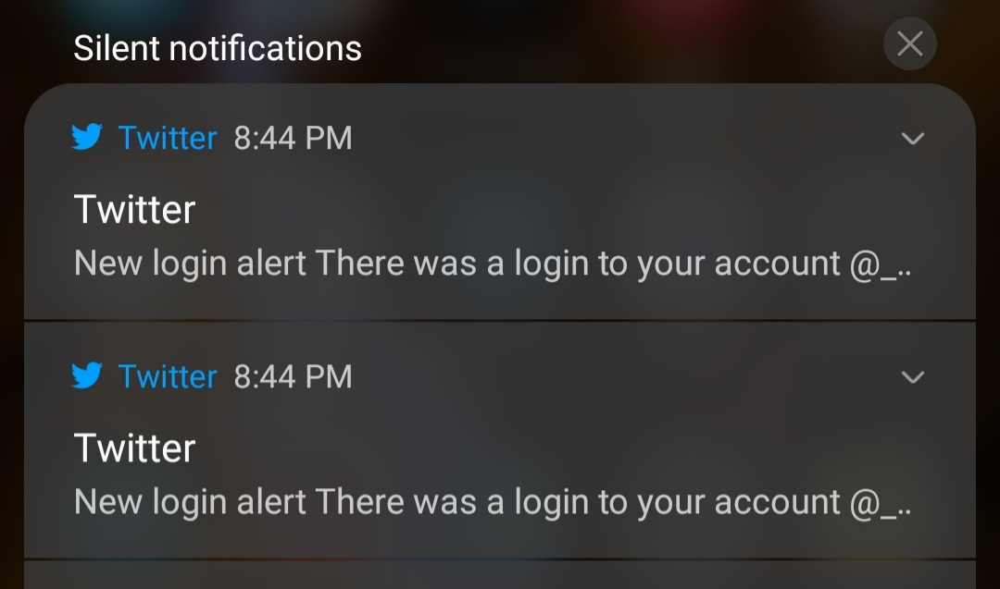

# fetch-twitter-bookmarks

**Interactive CLI application that fetches your Twitter bookmarks and saves them to a SQLite database**

* **[Goals](#goals)**
* **[How it works](#how-it-works)**
* **[IMPORTANT](#important)**
* **[How to use](#how-to-use)**
  * **[Requirements](#requirements)**
  * **[Installation](#installation)**
  * **[Running](#running)**
    * ***[Commands](#commands)***
    * ***[Arguments](#arguments)***
  * **[Logging](#logging)**
  * **[Database](#database)**
  * **[Testing](#testing)**
* **[Initial approach](#initial-approach)**
* **[License](#license)**
* **[Feedback](#feedback)**

<a name="goals"></a>
# Goals

- Be a means to fetch your bookmarks without needing Twitter's developer API
- Fetch bookmarks using a means as reliable and sturdy as possible (rather, this tool should work on its own for as long as possible, without needing to make drastic changes)

<a name="how-it-works"></a>
# How it works
At the moment, Twitter offers no means through their current developer API enabling you to fetch your bookmarks. However, there's a means to do so through an API endpoint the bookmarks page references (see below). I'm aware [their team is working on it](https://twittercommunity.com/t/twitter-bookmarks-not-accessible-via-the-api/142160), though.

1. To leverage this API endpoint, you'll need to login on Twitter's site, which this application will do on your behalf via a headless browser ([playwright](https://playwright.dev/)). If Twitter prompts you for a code to log in (either because you have 2FA turned on or because they suspect a "suspicious" login), you'll then be prompted for your authentication code. 

2. When you wish to start fetching bookmarks, the browser navigates to the bookmarks page, and watches for a network request to a specific API endpoint matching this pattern:

`https://twitter.com/i/api/graphql/$QUERY_ID/$OPERATION_NAME?variables=$QUERY_PARAMETERS`

For fetching bookmarks, `$OPERATION_NAME` will be `'Bookmarks'`. Both `$QUERY_ID` and `$OPERATION_NAME` are referenced in a specific object (below) inside a script loaded on the bookmarks page called `main.XXXXXXXXX.js`. These variables in the URL path are required to make successful calls to the API. Because playwright is able to listen for any network calls matching this URL, we're able to avoid hunting for the necessary info in this script file.

```javascript
{queryId:"$QUERY_ID",operationName:"Bookmarks",operationType:"query"}
```

The query parameter `variables` is url-encoded JSON, and represents the query parameters. For convenience, and to doubly make sure the tool presents like a browser to Twitter, the same parameters the bookmarks page already passes to the query are used, including request headers. There will be an option later to allow you to override a selection of these query parameters.

There are certain request headers the API seems to expect (i.e. an authorization token), which is the sole reason why the step of logging you in with a browser is necessary for the app to fetch data from this endpoint.

A successful response returns the most recent bookmarks you've saved to your account. Also present in the response is a cursor (string), a marker necessary to fetch the next page of bookmarks. The most recent bookmarks from this initial response will be saved if the application doesn't have a cursor to fetch the next set of bookmarks from (most likely the case if you're running it for the first time). This cursor also enables the application to resume fetching bookmarks from the last successful attempt in case of an error, or if you decide to stop.

3. Using said response, [superagent](https://visionmedia.github.io/superagent/) then makes subsequent requests to the API URL, and fetches as many bookmarks as possible. An intentional delay of 300ms is added in between these subsequent responses to pretend like a human is scrolling through the bookmarks page; an option to change/remove that delay will be added later. Upon each successful response, the bookmarks and the next cursor are saved to the database. 

There will be an option later to let you set the cursor yourself, or begin fetching bookmarks from the beginning.


<a name="important"></a>
# IMPORTANT

This application is in flux. Breaking changes to internal architecture should be anticipated until I decide to cut version 1.0.0.

This application relies heavily on the idea that you can log in to Twitter via a browser, and leverage the above mentioned API endpoint to pull bookmarks from. Twitter may change access to their API endpoint, including the data available to you, or the structure of said data from this endpoint, at any time, without notice.

Because this application uses a headless browser to log in on your behalf, you'll receive login notifications like the ones I did below. When you run [tests](#testing), you'll probably see several of these. If you login frequently, Twitter may ask you to sign in with your username/phone only.



<a name="how-to-use"></a>
# How to use

<a name="requirements"></a>
## Requirements

I've only run this on the following node and npm versions, on Windows 10 with WSL2 running Ubuntu. 
There's a chance it may run on earlier node/npm versions, but I haven't tested this.

* `node` >= 14.x
* `npm` >= 7.x
* A TTY-capable terminal. 
  Quickly check this by running ```node -e "console.log(process.stdout.isTTY)"```. 
  If it prints `true`, you're set.

<a name="installation"></a>
## Installation

1. From a directory of your choice, clone this repo with
```sh
git clone https://github.com/helmetroo/fetch-twitter-bookmarks.git
```

2. Change into the newly created directory, and install all the required modules.
```sh
cd fetch-twitter-bookmarks

npm i
```

<a name="running"></a>
## Running
The application is an interactive shell that accepts commands, powered by [Vorpal](https://vorpal.js.org/). 

You can run the `help` command at any time for help on commands available to you at the current moment.

If you're in the same directory as the application, you can run it with
```sh
npm start
```

See the [arguments section](#arguments) for more details about the arguments you can provide and how to provide them.

1. When you first run the app, you'll see a list of browsers you can run. Run the command `set-browser <name>` (alias `browser`). `<name>` can be any one of the available browser choices runnable on your machine, which you can see with `help`.
2. After you set the browser, you can `login` (aliases `signin`, `authenticate`). You'll be prompted for your credentials. If login was successful, you'll see a success message and can start fetching bookmarks. However, you may be prompted to login with your username/phone only, or be asked to provide a specific authorization code (2FA or other identification code Twitter may ask you for to make sure it's you).
3. You can start fetching bookmarks with `fetch` (alias `start`). The browser will navigate to the bookmarks page, watch for a call to the bookmarks API (see [how it works](#how-it-works) for more info on this), then repeatedly make calls to this API until no more bookmarks can be fetched (either because there are no more to fetch, or an error was encountered). You can stop fetching at any time with the `stop` command.
4. When you're finished, you can either end your session with `end` (alias `close`), if you want to choose a different browser, or you can `exit` the application entirely. Both commands will log you out first if you were signed in.

At any time, you can dump bookmarks saved in the database to a JSON file with the `dump <filename>` command. See the [filenames](#filenames) section for how filenames are resolved.

<a name="filenames"></a>
### Filenames

Filenames are resolved in [this manner](https://nodejs.org/docs/latest-v14.x/api/fs.html#fs_file_paths).
They can be absolute or relative. Relative paths are resolved relative to the current working directory from which you run the app.

<a name="commands"></a>
### Commands

To show help prompts for commands, you can add the option `--help` after each command.

#### `help`

Shows help prompt for all currently available commands.

#### `set-browser <name>` (alias `browser`)

Sets the browser. Necessary to log in and fetch bookmarks. Browser choices available to you are determined each time you start the app. To change browsers after setting a browser, run `end`, then choose another browser.

#### `set-database <filename>` (aliases `database`, `set-db`, `db`)

Sets the database bookmarks are saved to. Command not available if you are in the middle of fetching bookmarks.
Providing `<filename>` is the same as setting `-f` or `--file`.

##### Options
- `-m` or `--in-memory`: Database is stored in-memory. Useful if you don't want to save a database file. All saved bookmarks will be lost when you exit. Ignored if `-f` or `-d` is set.
- `-f <filename>` or `--file <filename>`: Database is saved to `<filename>`. Ignored if `-m` or `-d` is set.
- `-d` or `--default`: Database is saved to the default location (`$APP_ROOT/twitter-bookmarks.db`). Ignored if `-m` or `-f` are set.

#### `set-log <filename>` 

Sets the location for log files.

#### `clear-log` 

Clears the current log file by removing it and creating a new empty file.

#### `login` (aliases `signin` and `authenticate`)

Log in to Twitter. Necessary to begin fetching bookmarks. Available after you've set the browser (see above).

#### `fetch` (alias `start`)

Begins fetching bookmarks. Bookmarks will be fetched from either the last saved cursor, or from the very beginning if the app hasn't saved a cursor to the bookmarks database. Command available after you've set a browser and logged in.

#### `stop` 

Stops fetching bookmarks. Command available while you're fetching bookmarks.

#### `end` 

Ends your session. Bookmarks will stop being fetched, and you'll also be logged out. Run when you want to switch browsers and/or accounts.

#### `dump <filename>`

Dumps saved bookmarks in the database to a JSON file.

#### `exit` 

Exits the application.

<a name="arguments"></a>
### Arguments

- `-m` or `--in-memory`: Database is kept in memory. Useful if you don't want to save a database file. All saved bookmarks will be lost when you exit. Ignored if `-f` is set.
- `-f <filename>` or `--file <filename>`: Database is saved to `<filename>`. Ignored if `-m` is set.
- `-d` or `--default`: Database is saved to the default location (`$APP_ROOT/twitter-bookmarks.db`). Ignored if `-m` or `-f` are set.
- `-l <filename>` or `--log-file <filename>`: Log files are saved to `<filename>`.
- `--clear-log`: Logs are cleared. If a log file is provided through `-l`, that log file will be cleared. Otherwise, the default log will be cleared.

If you're running the app via npm, arguments are added after an extra set of dashes, like below:

```sh
npm start -- -f $HOME/bookmarks.db
```

<a name="logging"></a>
## Logging
Network requests, and full details of internal errors not shown to you are saved to log files via [winston](https://github.com/winstonjs/winston).
The default location for logs is `$APP_ROOT/logs/debug.log`.

<a name="database"></a>
## Database
Bookmarked tweets, and available metadata for their respective authors, as well as the cursor (see [how it works](#how-it-works) for more details on the cursor) are saved in a SQLite database file. The default location of this database is the `$APP_ROOT/twitter-bookmarks.db`, although you can change this with the designated command-line arguments and commands above. You can explore the database with a [CLI tool](https://sqlite.org/cli.html) or [GUI](https://sqlitestudio.pl/).

Definitions for the database schema for bookmarked tweets and their authors can be found in [tweets-db.ts](./src/client/tweets-db.ts).

TypeScript interfaces for bookmarked tweets and their authors are in [twitter.ts](./src/constants/twitter.ts). The interfaces are based off successful responses from the bookmarks API endpoint in Chrome DevTools and making (hopefully good) speculations.

[Sequelize](https://sequelize.org/) is used to maintain the database schema, as well as save and retrieve bookmarked tweets, their respective authors, and the cursor to fetch the next set of bookmarks from.

<a name="testing"></a>
## Testing
Currently working functionality uses Jest to run tests against it. As mentioned above, this application is in flux. Tests are not guaranteed to be in sync with structural changes made, until I decide to cut version 1.0.0. 

All tests are set up to run against every browser playwright can run on your machine.

Some tests require real user credentials to work. You can add these in a `.env` file in this application's root directory:

```text
FTB_TWITTER_USERNAME=...
FTB_TWITTER_PASSWORD=...
```

Run tests with
```sh
npm test
```
<a name="initial-approach"></a>
# Initial approach

An earlier method used a scraper-based approach entirely with Puppeteer to visit the bookmarks page on your behalf, continuously scrolling down and scraping encountered tweets, assuming Twitter always wrapped them in `<article />` elements. To see how that worked and the implementation for that approach, [take a look here](https://github.com/helmetroo/fetch-twitter-bookmarks/tree/1232e7aa308e65e8b80f6fbf4bf928575194edf1). I decided that was far too malleable and complex.

<a name="license"></a>
# License

TBD

<a name="feedback"></a>
# Feedback

Questions or thoughts on this application? Have ideas for a better approach? I'd love to hear them. Open an [issue](https://github.com/helmetroo/fetch-twitter-bookmarks/issues) or email me.
